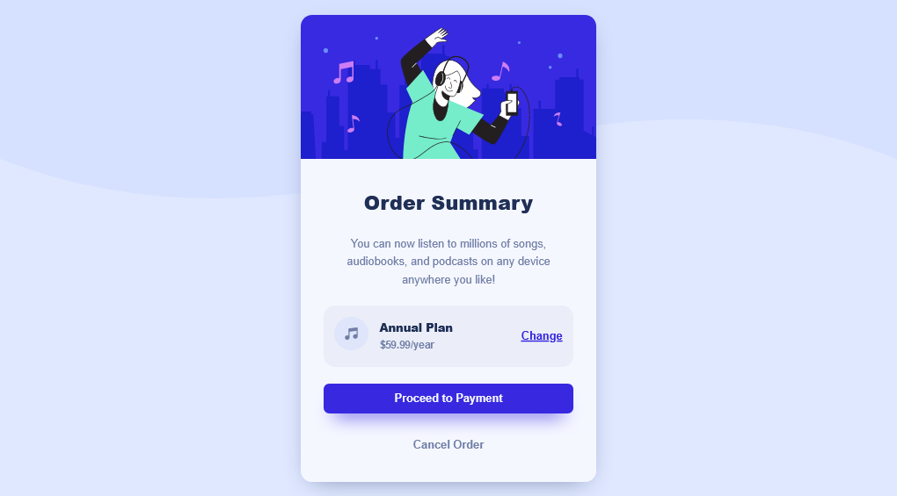

# Frontend Mentor - Calculator app solution

Welcome I am [Samir Ahmad](https://github.com/SamirAhmad5445) and this is a solution to the [Order summary component](https://www.frontendmentor.io/challenges/order-summary-component-QlPmajDUj). Frontend Mentor challenges help you improve your coding skills by building realistic projects.

## Table of contents

- [Overview](#overview)
  - [Screenshot](#screenshot)
  - [Links](#links)
- [My process](#my-process)
  - [Built with](#build-with)
  - [What I learned](#what-i-learned)
  - [Continued development](#continued-development)
- [My Accounts](#my-accounts)
  - [Gmaill](mailto:samirahmad5445@gmail.com)
  - [GitHub](https://github.com/SamirAhmad5445)
  - [Frontend Mentor](https://www.frontendmentor.io/profile/SamirAhmad5445)

## Overview

### Screenshot

### Links

- Solution URL: [Go To The Github Repo](https://github.com/SamirAhmad5445/order-summary-component-main)
- Live Site URL: [Click Here for The Live Page](https://samirahmad5445.github.io/order-summary-component-main/)

## My Process

### Built With

- Semantic HTML5 markup
- CSS custom properties
- CSS pseudo selectors
- [CUBE CSS](https://cube.fyi/) - CSS naming convention
- Flexbox
- CSS Grid
- Vaneilla JavaScript

### What I Learned

In This challenge I learned how to use the naming convention [CUBE CSS](https://cube.fyi/), It is So much easier to use data attributes insteed of the double dash like BEM and also the utility classes come in handy a lot with the layout or the composition classes and I am planning to use [CUBE CSS](https://cube.fyi/) as my main naming convention.

### Continued Development

I would learn more about SASS and the CSS Preprossers and also I would like to get into the world of JavaScript Frameworks and inprove my frontend skills with Good Fundamentals, Practical Applications, and by learning more technologies like PostCSS and gulp to increase the efficience of my code.

## My Accounts

- GitHub - [@SamirAhmad5445](https://github.com/SamirAhmad5445)
- Gmaill - [samirahmad5445@gmail.com](samirahmad5445@gmail.com)
- Frontend Mentor - [@SamirAhmad5445](https://www.frontendmentor.io/profile/SamirAhmad5445)
